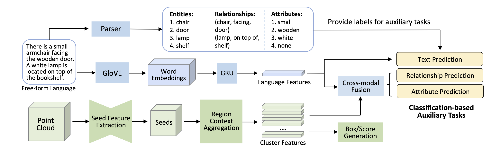

# Language-Assisted-3D

This repository contains the implementation of the paper **Language-Assisted 3D Feature Learning for Semantic Scene Understanding**.


## Setup

The code was developed and tested on Ubuntu 18.04, with PyTorch 1.6.0 CUDA 10.2 installed. Please execute the following command to install PyTorch:

```shell
conda create -n lang-3d python=3.8
conda activate lang-3d
conda install pytorch==1.6.0 torchvision==0.7.0 cudatoolkit=10.2 -c pytorch
```

Install the necessary packages listed out in `requirements.txt`:
```shell
pip install -r requirements.txt
```
After all packages are properly installed, please run the following commands to compile the CUDA modules for the PointNet++ backbone:
```shell
cd lib/pointnet2
python setup.py install
```

__Before moving on to the next step, please don't forget to set the project root path to the `CONF.PATH.BASE` in `lib/config.py`.__

## Dataset

### ScanRefer Dataset

We use the data generated by ScanRefer codebase. You can follow the [Data preparation](https://github.com/daveredrum/ScanRefer#data-preparation) guide to preprocess data. Then, put it under the `data` folder.

### Language Parser

Please follow follow the [README](./language_parser/README.md) under the `language_parser` folder. Copy the generated files `ScanRefer_filtered_train_parser.json` and `ScanRefer_filtered_val_parser.json` under the `data` folder.


### Directory Structure
Finally, the dataset files should be organized as follows.

```
data
├── glove.p
├── scannet
│   ├── batch_load_scannet_data.py
│   ├── load_scannet_data.py
│   ├── meta_data/
│   ├── model_util_scannet.py
│   ├── README.md
│   ├── scannet_data/
│   ├── scannet_utils.py
│   ├── scans/
│   └── visualize.py
├── ScanRefer_filtered_train_parser.json
├── ScanRefer_filtered_val_parser.json
```
## Usage
### Training

To train the ScanRefer model for detection with RGB values:
```shell
python -u -m torch.distributed.launch --nproc_per_node=8 scripts/train.py --use_color --relation_prediction --color_prediction --size_prediction --shape_prediction --no_reference --batch_size 12 --val_step 1 --lr 8e-3 --epoch 60
```

To train the ScanRefer model for detection with multiview values:
```shell
python -u -m torch.distributed.launch --nproc_per_node=8 scripts/train.py --use_multiview --use_normal --relation_prediction --color_prediction --size_prediction --shape_prediction --no_reference --batch_size 12 --val_step 1 --lr 8e-3 --epoch 60
```

To train the ScanRefer model for visual grounding with RGB values:
```shell
python -u -m torch.distributed.launch --nproc_per_node=8 scripts/train.py --use_color --relation_prediction --color_prediction --size_prediction --shape_prediction --batch_size 12 --val_step 1 --lr 8e-3 --epoch 60
```

To train the ScanRefer model for detection with multiview values:
```shell
python -u -m torch.distributed.launch --nproc_per_node=8 scripts/train.py --use_multiview --use_normal --relation_prediction --color_prediction --size_prediction --shape_prediction --batch_size 12 --val_step 1 --lr 8e-3 --epoch 60
```

### Evaluation
To evaluate the trained ScanRefer models for detection, please find the folder under `outputs/` with the current timestamp and run:
```shell
python scripts/eval.py --folder <folder_name> --detection --use_color --no_nms --force --repeat 5
```

To evaluate the trained ScanRefer models for visual grounding, please find the folder under `outputs/` with the current timestamp and run:
```shell
python scripts/eval.py --folder <folder_name> --reference --use_color --no_nms --force --repeat 5
```

### Visualization
To predict the localization results predicted by the trained ScanRefer model in a specific scene, please find the corresponding folder under `outputs/` with the current timestamp and run:
```shell
python scripts/visualize.py --folder <folder_name> --scene_id <scene_id> --use_color
```
Note that the flags must match the ones set before training. The training information is stored in `outputs/<folder_name>/info.json`. The output `.ply` files will be stored under `outputs/<folder_name>/vis/<scene_id>/`

## Cite

If you find our work helpful for your research. Please consider citing our paper.

```
@inproceedings{zhang2022language,
  title={Language-Assisted 3D Feature Learning for Semantic Scene Understanding},
  author={Zhang, Junbo and Fan, Guofan and Wang, Guanghan and Su, Zhengyuan and Ma, Kaisheng and Yi, Li},
  booktitle={AAAI},
  year={2023}
}
```

## Acknowledgement

Our code is based on [SceneGraphParser](https://github.com/vacancy/SceneGraphParser) and [ScanRefer](https://github.com/daveredrum/ScanRefer). Thanks to all.

## License

Language-Assisted-3D is released under the MIT License. See the [LICENSE](./LICENSE) file for more details.
